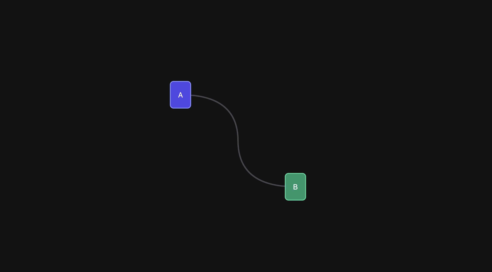
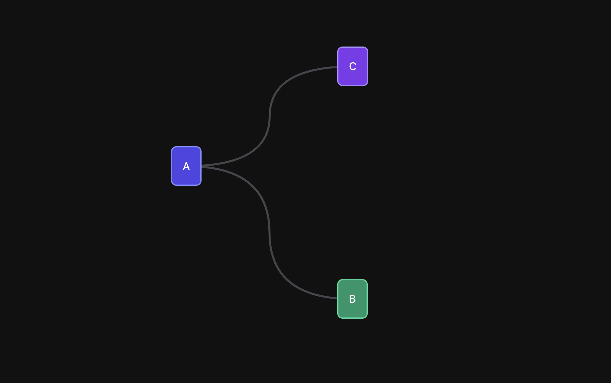

# React Connect Div

react-connect-div is a lightweight npm package designed for connecting two HTML div elements together with a line, facilitating visual connections within your React applications.

## Installation:

You can install `react-connect-div` via npm:

```bash
npm install react-connect-div
```

## Usage:

To utilize `react-connect-div`, import it into your React component and use it as follows:

```tsx
import DivConnector from "react-connect-div";

function App() {
    return (
        <main>
            <div className="A">A</div>
            <div className="B">B</div>
            <DivConnector from=".A" to=".B" />
        </main>
    );
}
```

## Props:

| Prop        | Type   | Required | Default   | Description                              |
| ----------- | ------ | -------- | --------- | ---------------------------------------- |
| from        | string | Yes      | -         | CSS selector of the first element        |
| to          | string | Yes      | -         | CSS selector of the second element       |
| container   | string | No       | -         | CSS selector of container                |
| borderColor | string | No       | '#44464C' | The color of the connecting line.        |
| borderWidth | number | No       | 3         | The thickness of the connecting line.    |
| refreshWhen | number | No       | -         | CSS class name of the desired container. |

## Examples:

```tsx
import DivConnector from "react-connect-div";

function App() {
    return (
        <main>
            <div className="A">A</div>
            <div className="B">B</div>
            <DivConnector from=".A" to=".B" />
        </main>
    );
}
```



---

```tsx
import DivConnector from "react-connect-div";

function App() {
    return (
        <main>
            <div className="A">A</div>
            <div className="B">B</div>
            <div className="C">C</div>
            <DivConnector from=".A" to=".B" />
            <DivConnector from=".A" to=".C" />
        </main>
    );
}
```


